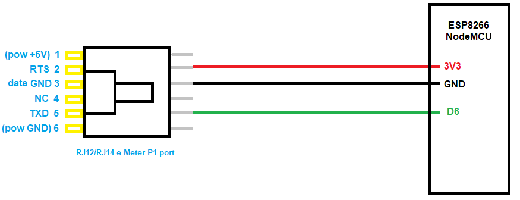

# e-Meter P1 port
ESP8266 Arduino sketch to read Dutch e-Meters and upload to ThingSpeak.

Disclaimer: I put the Arduino sketck on GitHub nearly three years after I developed it. 
As a consequence, this README.md is written later and may not be completely accurate.

## Introduction
In the Netherlands, new electricity meters (e-meters) are being rolled out. These meters are referred to
as [smart](https://nl.wikipedia.org/wiki/Slimme_meter). A smart meter is a digital (gas- or) electricy meter
that can be remotely read. 

The Dutch goverment has [standardized](https://www.netbeheernederland.nl/_upload/Files/Slimme_meter_15_91e8f3e526.pdf) smart meters. 
One interesting aspect is that Dutch smart meters are required to have a so-called P1 port. Basically, this is a (transmit-only)
serial port, that spits out the meter readings every 10 seconds.

This project uses an ESP8266 to receive the readings, and uploads them to the cloud ([ThingSpeak](https://thingspeak.com/)).

## Wiring

As mentioned in the introduction, the P1 port is basically a serial port.

### Considerations
However, in practice there are some considerations.

 - The P1 port is write-only (from the perspective of the meter).
 - The P1 port does seem to deliver sufficient power (5V, 250mA), nevertheless, I run my NodeMCU from a separate USB power supply.
 - The P1 port has a "data request", this must be pulled high, for the e-meter to produce data.
 - The P1 port has a "data out" which uses UART encoding: 115200/*/N/1.
 - However, as the specification states 
   _the “Data” line must be designed as an Open Collector output, the “Data” line must be logically inverted_. 
   In other words, the signal is inverted.

### Wire to PC (USB)
I started this project with an [FTDI cable](https://nl.farnell.com/ftdi/ttl-232r-3v3/cable-usb-to-ttl-level-serial/dp/1329311). 
On the [FTDI website](https://www.ftdichip.com/Support/Utilities.htm)
you can download FT_Prog. This windows program allows configuring an FTDI cable: "5.5 FT232R Hardware_Specific"
explains "Additional features available on the FT232R device allow RS232 signals to be inverted". 
That's what we need for the data pin.

You can also buy a [dedicated cable](https://www.aliexpress.com/i/32945225256.html).


### Wire to ESP8266
For the real project, we will use a software UART on the ESP8266, so no "active" is needed.

The connector to mate with the e-meter is an RJ (telephone) jack. 
The official standard prescribes an **RJ12**	plug, which is a 6 pole 6 connector (6P6C) plug.
Since we will not use the outer two pins (power), we can also take a **RJ14** (6P4C) plug.

This is the wiring:



## Parsing
Once the wiring is established, we receive data.
This is an example from some e-Meter found [elsewhere](http://domoticx.com/p1-poort-slimme-meter-hardware/).

```
/ISk5\2MT382-1 000
1-3:0.2.8(40)
0-0:1.0.0(101209113020W)
0-0:96.1.1(4B384547303034303436333935353037)
1-0:1.8.1(123456.789*kWh)
1-0:1.8.2(123456.789*kWh)
1-0:2.8.1(123456.789*kWh)
1-0:2.8.2(123456.789*kWh)
0-0:96.14.0(0002)
1-0:1.7.0(01.193*kW)
1-0:2.7.0(00.000*kW)
0-0:17.0.0(016.1*kW)
0-0:96.3.10(1)
0-0:96.7.21(00004)
0-0:96.7.9(00002)
1-0:99:97.0(2)(0:96.7.1 9)(101208152415W)(0000000240*s)(101208151004W)(00000000301*s)
1-0:32.32.0(00002)
1-0:52.32.0(00001)
1-0:72:32.0(00000)
1-0:32.36.0(00000)
1-0:52.36.0(00003)
1-0:72.36.0(00000)
0-0:96.13.1(3031203631203831)
0-0:96.13.0(303132333435363738393A3B3C3D3E3F303132333435363738393A3B3C3D3E3F303132333435363738393A3B
3C3D3E3F303132333435363738393A3B3C3D3E3F303132333435363738393A3B3C3D3E3F)
0-1:24.1.0(03)
0-1:96.1.0(3232323241424344313233343536373839)
0-1:24.2.1(101209110000W)(12785.123*m3)
0-1:24.4.0(1)
!522B
```

We need to understand the data.
The official [spec](https://www.netbeheernederland.nl/_upload/Files/Slimme_meter_15_a727fce1f1.pdf) is helpful here.


## Product in detail
My project is a rather complete "product":
 - The product can do a web-post.
   I typically use this to upload to [ThingSpeak](https://thingspeak.com/).
   If you want that create an account there and then a channel to receive the P1 port data. 
   I would advise to set the channel to "private".
 - The product can do a web-get.
   I typically use this to send data (current electricity usage) to an ESP8266 based display.
   See a [video example](https://youtu.be/ZBvKilhE66w).
 - When pressing the 'flash' button while booting, the product starts an access point and webserver through which
   the user can configure the SSID and password of the WiFi network. Also the post message and/or get message
   can be configured.
   


For the configuration, I used my own [Cfg](https://github.com/maarten-pennings/Cfg) library,
which my [Nvm](https://github.com/maarten-pennings/Nvm) library.

I used software serial. I believe it comes as a standard Arduino library, but maybe I downloaded it 
[here](https://github.com/plerup/espsoftwareserial/blob/master/src/SoftwareSerial.h). 


## Source
The source code is available in [emp1](emp1) directory.

   
