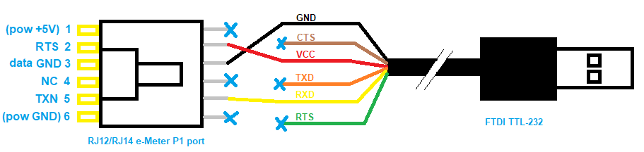

# Generation 0

Getting eMeter P1 port data with an FTDI cable.

# Introduction

Does my meter spit out data, and can I get my hands on it?

The P1 port is a standard UART, but in practice it has some peculiarities.

 - The P1 port is write-only (from the perspective of the meter).
 - The P1 port does seem to deliver sufficient power (5V, 250mA).
   Nevertheless, **my board resets while booting when powered from the meter**.
   After several trials I run my NodeMCU from a separate USB power supply.
 - The P1 port has a "data request" (RTS), this must be pulled high, for the e-meter to produce data.
 - The P1 port has a "data out" which uses UART encoding: 115200/8/N/1.
 - However, as the specification states 
   _the "Data" line must be designed as an Open Collector output, the "Data" line must be logically inverted_. 
   In other words, the eMeter TX signal is inverted.

# Wiring

For a proof of concept, I started with an [FTDI cable](https://nl.farnell.com/ftdi/ttl-232r-3v3/cable-usb-to-ttl-level-serial/dp/1329311). 
On the [FTDI website](https://www.ftdichip.com/Support/Utilities.htm)
you can download **FT_Prog**. This windows program allows configuring an FTDI cable.
The crucial aspect is that we can invert the RX data line. 
Section "5.5 FT232R Hardware_Specific" explains "Additional features available on the FT232R device allow RS232 signals to be inverted". 
That's what we need for the data pin.

You can also buy a [dedicated cable](https://www.aliexpress.com/i/32945225256.html).

(end)
