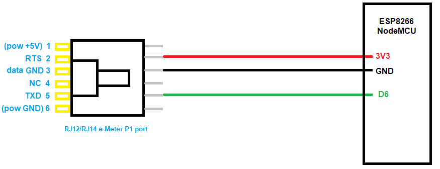
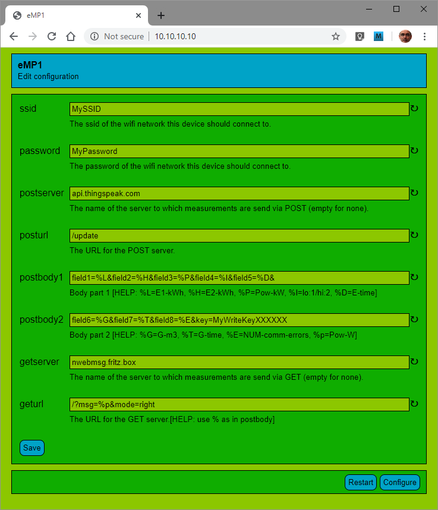

# Generation 1

ESP8266 Arduino sketch to read Dutch e-Meters and upload to ThingSpeak.

Disclaimer: I put this Arduino sketch on GitHub nearly three years after I developed it. 
As a consequence, this readme is written later and may not be completely accurate.

Note: this is generation 1; it uses the SoftwareSerial library to read the serial link
from the e-Meter. This is needed because the e-Meter inverts the line. 
Later I found out that the ESP UART block has hardware support to invert the line back. 
That is when I made [generation 2](../gen2). It is suggested to use that version.


## Warning

As mentioned in the intro, this project uses the SoftwareSerial library, a bit bang implementation of UART.
Bit banging is time critical, and as a result, the bytes received are sometime wrong.
Fortunately, the P1 telegrams have a CRC16 checksum, so those errors are detected.

When using ESP8288 board support 2.3.0, about 2% of the telegrams are corrupt.
However, later versions have much higher levels of corruptions.
See the [test](testswser.md) I did.

Please note that this project very probably 
**requires you to downgrade your ESP board support**.


##  Wire P1 to ESP8266

The connector to mate with the e-meter is an RJ ("telephone") jack. 
The official standard prescribes an **RJ12**	plug, which is a 6 pole 6 connector (6P6C) plug.
Since I did not use the outer two pins (power), we can also take a **RJ14** (6P4C) plug: it has 6 poles, 
but only the middle 4 are wired (I did not succeed in running the ESP8266 from the 5V of the e-Meter, using the outer two poles).

This is the wiring:



Observe that we pull up RTS with 3V3, this appears enought for the e-Meter to generate
telegrams over TXN.


## Parsing
Once the wiring is established, we receive data.
This is an example from some e-Meter found [elsewhere](http://domoticx.com/p1-poort-slimme-meter-hardware/).

```
/ISk5\2MT382-1 000
1-3:0.2.8(40)
0-0:1.0.0(101209113020W)
0-0:96.1.1(4B384547303034303436333935353037)
1-0:1.8.1(123456.789*kWh)
1-0:1.8.2(123456.789*kWh)
1-0:2.8.1(123456.789*kWh)
1-0:2.8.2(123456.789*kWh)
0-0:96.14.0(0002)
1-0:1.7.0(01.193*kW)
1-0:2.7.0(00.000*kW)
0-0:17.0.0(016.1*kW)
0-0:96.3.10(1)
0-0:96.7.21(00004)
0-0:96.7.9(00002)
1-0:99:97.0(2)(0:96.7.1 9)(101208152415W)(0000000240*s)(101208151004W)(00000000301*s)
1-0:32.32.0(00002)
1-0:52.32.0(00001)
1-0:72:32.0(00000)
1-0:32.36.0(00000)
1-0:52.36.0(00003)
1-0:72.36.0(00000)
0-0:96.13.1(3031203631203831)
0-0:96.13.0(303132333435363738393A3B3C3D3E3F303132333435363738393A3B3C3D3E3F303132333435363738393A3B
3C3D3E3F303132333435363738393A3B3C3D3E3F303132333435363738393A3B3C3D3E3F)
0-1:24.1.0(03)
0-1:96.1.0(3232323241424344313233343536373839)
0-1:24.2.1(101209110000W)(12785.123*m3)
0-1:24.4.0(1)
!522B
```

We need to understand the data.
The official [spec](https://www.netbeheernederland.nl/_upload/Files/Slimme_meter_15_a727fce1f1.pdf) is helpful here.
However, I do have a v4.2 meter, and the [spec](https://www.netbeheernederland.nl/_upload/Files/Slimme_meter_15_32ffe3cc38.pdf) differs on details.


## Product in detail
My project is a rather complete "product":
 - The product can do a web-post.
   I typically use this to upload to [ThingSpeak](https://thingspeak.com/).
   If you want that, create an account there, and then a channel to receive the P1 port data. 
   I would advise to set the channel to "private".
 - The product can do a web-get.
   I typically use this to send data (current electricity usage) to an ESP8266 based display.
   See a [video example](https://youtu.be/ZBvKilhE66w).
 - When pressing the 'flash' button while booting, the product starts an access point and web server through which
   the user can configure the SSID and password of the WiFi network. Also the post message and/or get message
   can be configured.

I used a SoftwareSerial library. I believe it comes as a standard Arduino library, but maybe I downloaded it 
[here](https://github.com/plerup/espsoftwareserial/blob/master/src/SoftwareSerial.h). 

For the configuration, I used my own [Cfg](https://github.com/maarten-pennings/Cfg) library,
with my [Nvm](https://github.com/maarten-pennings/Nvm) library.



This is a screenshot from the configuration screen.
The first two fields configure your (home) SSID and password,
so that the ESP8266 can reach web servers to send the measured data to.

Next, you can configure a POST and/or a GET to web server.
The  data message that will be send can be configured.
A field like `%p` is replaced by the current power in Watt.

The screen shot shows a configuration for posts to ThingSpeak and a get to a local display that I made from an ESP8266.


## Source

The source code is available in [emp1](emp1) directory.


(end)
