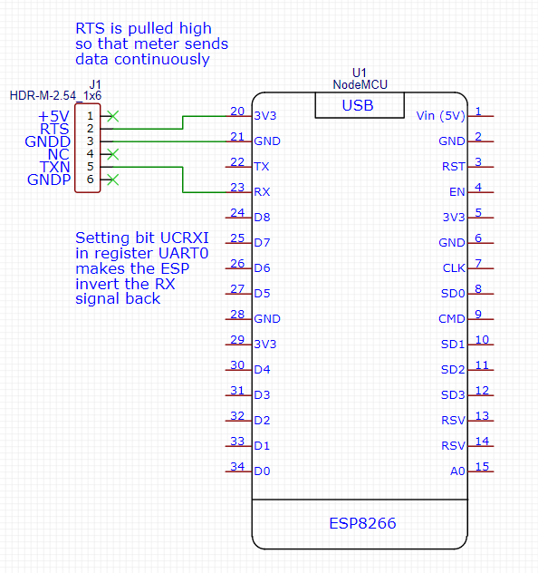

# Generation 2

This is generation 2 of the eMeterP1port firmware.

There are two reasons for a second generation. 
Firstly, generation 1 stopped working after a power outage.
Root cause was a a new object in the telegram (about the power outage) that caused a line buffer overflow.
Secondly, I found a hint to replace the software serial (bit-bang) by a hardware one.


## Redesign

I found two great [hints](https://github.com/daniel-jong/esp8266_p1meter). 
The first was that the ESP8266 has hardware support to invert the RX line.
So no more fiddling with a bit-banged serial that causes a lot of CRC errors. 

The second hint is that we can use the RX from UART0, we only need the TX for debugging and feedback towards the PC.
This works fine during normal operation, but not during flashing (program development): 
the Arduino flasher talks (TX) but also expects answers back (RX).


## Wiring

I wanted to power the ESP8266 from the power of the P1 port.
However I did not succeed: while booting, the board reset. I guess my meter can not source enough current; even adding caps did not help.

So, my [power schematic](schematic-powered.pdf) is down the drain.

I reverted to a [simple schematic](schematic-simple.pdf) - maybe I should add the pullup on TXN.




## Echo test

A simple proof of concept is the [p1echo](p1echo) sketch.
I captured some [telegrams](p1echo/meter.log) - note that I have overwritten 
the meter ID for privacy and adapted the CRC to make it match again.
I have annotated the first one below:

```text
/KFM5KAIFA-METER                               // / X X X 5 Identification CR LF
                                               // CR LF
1-3:0.2.8(42)                                  // Version information for P1 output // 4.2
0-0:1.0.0(220605132822S)                       // [20]22-06-05 13:28:22 S[ummertime]
0-0:96.1.1(456d795f73657269616c5f6e756d626572) // Equipment identifier // 'Emy_serial_number' // ''.join(chr(int(s[i:i+2],16)) for i in range(0,len(s),2))
1-0:1.8.1(019232.216*kWh)                      // Meter Reading electricity delivered **to** client (Tariff 1)
1-0:1.8.2(016881.373*kWh)                      // Meter Reading electricity delivered **to** client (Tariff 2)
1-0:2.8.1(000000.000*kWh)                      // Meter Reading electricity delivered **by** client (Tariff 1) 
1-0:2.8.2(000000.000*kWh)                      // Meter Reading electricity delivered **by** client (Tariff 2)
0-0:96.14.0(0001)                              // Tariff indicator electricity
1-0:1.7.0(00.393*kW)                           // Actual electricity power delivered (+P)
1-0:2.7.0(00.000*kW)                           // Actual electricity power received (-P)
0-0:96.7.21(00020)                             // Number of power failures in any phase
0-0:96.7.9(00008)                              // Number of long power failures in any phase
1-0:99.97.0(3)(0-0:96.7.19)(211209190618W)(0000003557*s)(210416081947S)(0000004676*s)(000101000011W)(2147483647*s) // Power Failure Event Log (long power failures)
1-0:32.32.0(00000)                             // Number of voltage sags in phase L1
1-0:52.32.0(00000)                             // Number of voltage sags in phase L2 
1-0:72.32.0(00000)                             // Number of voltage sags in phase L3 
1-0:32.36.0(00000)                             // Number of voltage swells in phase L1
1-0:52.36.0(00000)                             // Number of voltage swells in phase L2
1-0:72.36.0(00000)                             // Number of voltage swells in phase L3
0-0:96.13.1()                                  // UNKNOWN
0-0:96.13.0()                                  // Text message max 1024 characters
                                               // MISSING 1-0:32.7.0 // Instantaneous voltage L1 in V resolution
                                               // MISSING 1-0:52.7.0 // Instantaneous voltage L2 in V resolution
                                               // MISSING 1-0:72.7.0 // Instantaneous voltage L3 in V resolution
1-0:31.7.0(000*A)                              // Instantaneous current L1 in A resolution
1-0:51.7.0(001*A)                              // Instantaneous current L2 in A resolution
1-0:71.7.0(000*A)                              // Instantaneous current L3 in A resolution
1-0:21.7.0(00.001*kW)                          // Instantaneous power L1 (+P) in W resolution
1-0:22.7.0(00.000*kW)                          // Instantaneous power L1 (-P) in W resolution
1-0:41.7.0(00.205*kW)                          // Instantaneous power L2 (+P) in W resolution
1-0:42.7.0(00.000*kW)                          // Instantaneous power L2 (-P) in W resolution
1-0:61.7.0(00.187*kW)                          // Instantaneous power L3 (+P) in W resolution
1-0:62.7.0(00.000*kW)                          // Instantaneous power L3 (-P) in W resolution
0-1:24.1.0(003)                                // Device-Type
0-1:96.1.0(476d795f73657269616c5f6e756d626572) // Equipment identifier (Gas) 
0-1:24.2.1(220605130000S)(16051.302*m3)        // Last 5-minute Meter reading and capture time // [20]22-06-05 13:00:00S[ummertime]
                                               // MISSING 0-n:24.1.0 // Device-Type 
                                               // MISSING 0-n:96.1.0 // Equipment identifier  
                                               // MISSING 0-n:24.2.1 + 0-n:24.2.1 // Last 5-minute Meter reading and capture time (e.g. slave E meter)
!70CE                                          // ! CRC CR LF
/KFM5KAIFA-METER
```


## Parsing

Second program [p1parse](p1parse) parses the telegram.


## Product

The final firmware is the [eMeter P1 gen 2](emp1g2).


(end)

