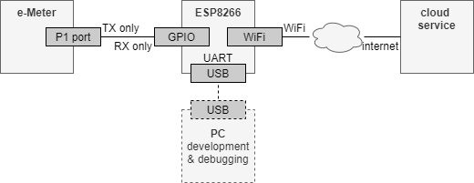

# Software Serial

This page logs my experiments getting the [EspSoftwareSerial](https://github.com/plerup/espsoftwareserial).
library working on my ESP8266.

## Introduction

### Setup

I have a smart electricity meter, following the 
[Dutch standards](https://www.netbeheernederland.nl/_upload/Files/Slimme_meter_15_32ffe3cc38.pdf).

Such a meter has a serial port, transmitting meter stats (every 10 seconds).
The meter has no RX, only TX, and the TX has its bits flipped.

I'm using an ESP8266 as host; it can upload the received e-meter stats to some cloud service using its WiFi stack.



Looking at the ESP8266, I want to use the (hardware) UART that is mapped to the USB for development and logging.
The ESP8266 does not have a second UART (there is a "half" TX only UART). 
Besides, the data coming from the e-Meter is inverted anyhow 
(see [logical levels](https://www.netbeheernederland.nl/_upload/Files/Slimme_meter_15_32ffe3cc38.pdf#page=6) SPACE "0" as > 4V, MARK "1" as < 1V)

So, my conclusion was that using a bit-banged serial port makes sense here.

And fortunately one exists: [EspSoftwareSerial](https://github.com/plerup/espsoftwareserial).
We do not even have to download it, it is available in the stock ESP8266 board package.

### Problem

The e-Meter sends stats every 10 seconds.
The stats are send as an textual page, each line containing a key value pair.
An example of a line in the page is `1-0:1.8.1(025707.312*kWh)`.
The `1-0:1.8.1` is the key, and `025707.312*kWh` the value.
The key denotes the "Meter Reading electricity delivered to client (low tariff) in 0,001 kWh" 
as specified by the [standard](https://www.netbeheernederland.nl/_upload/Files/Slimme_meter_15_32ffe3cc38.pdf#page=17).

The [standard](https://www.netbeheernederland.nl/_upload/Files/Slimme_meter_15_32ffe3cc38.pdf#page=7)
also specifies the whole page layout:

```
/AAA5AAAAA

...line...
...line...
...
...line...
!XXXX
```

A notable aspect is that the `XXXX` is a CRC16 of all bytes from (including) `/` up to (including `!`.

My problem is that the SoftwareSerial implementation looses so many bits that the CRC16 very often does not match.

It seems so bad that the current (April 2021) version of ESP8266 board package has a failure of 100%.


## Experiment


(end of doc)